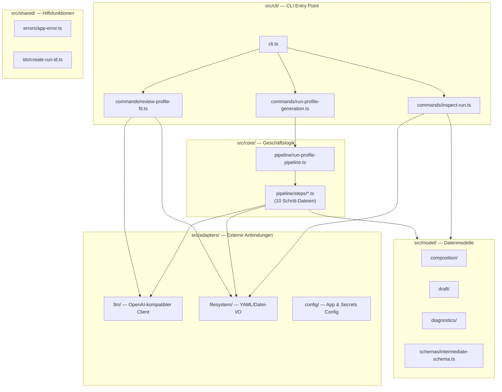
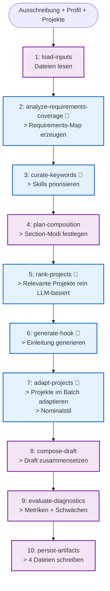
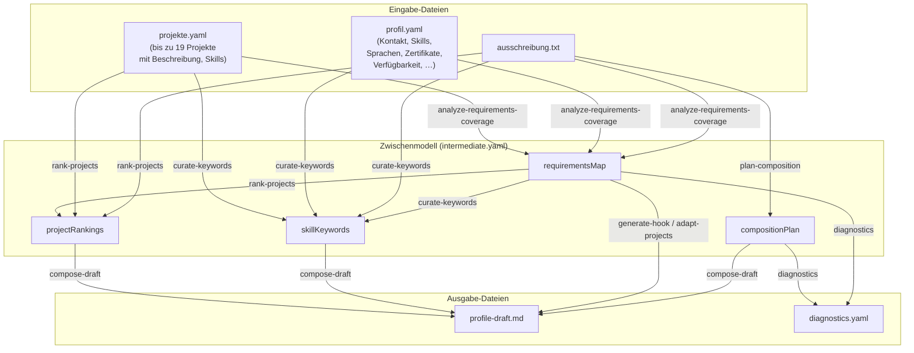
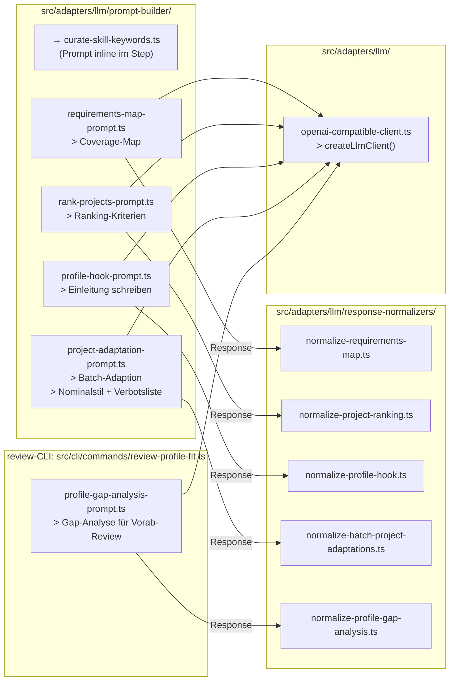
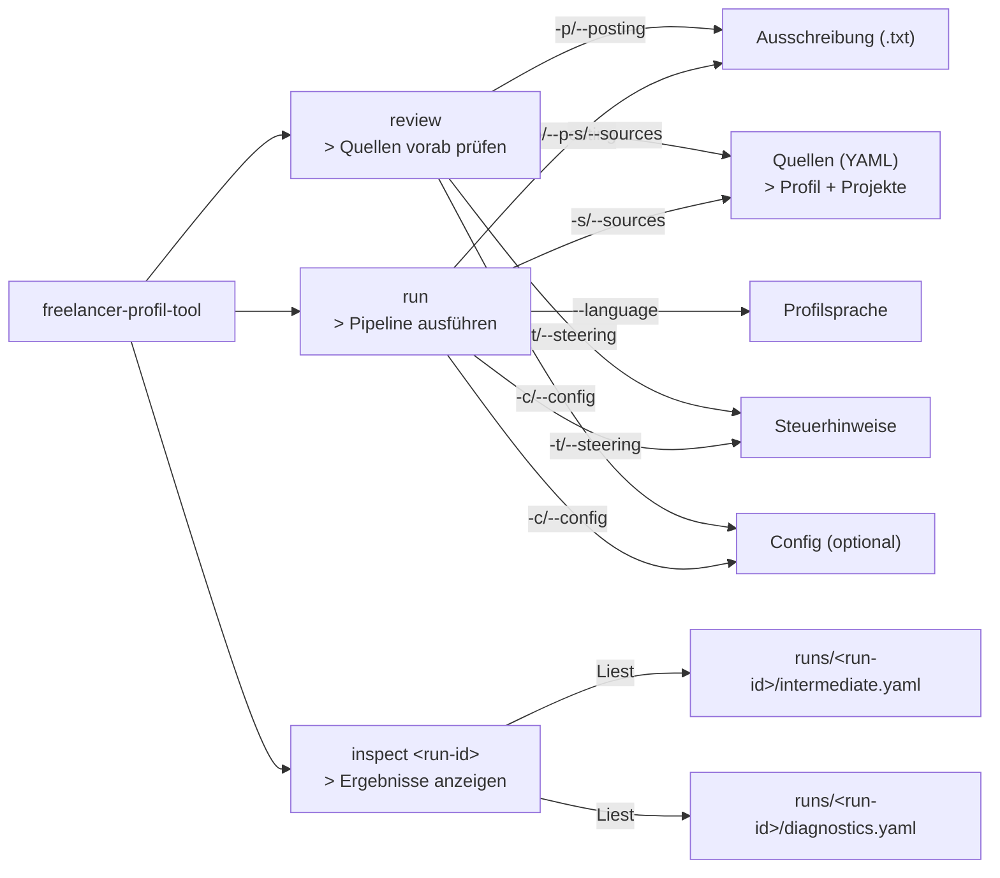

# Architektur — Freelancer Profil Tool

## Überblick

Das Freelancer Profil Tool generiert aus einer Ausschreibung (Job Posting) und vorhandenem Quellmaterial (Profil, Projekthistorie) einen massgeschneiderten Markdown-Profilentwurf. Die Verarbeitung erfolgt als schlanke Pipeline mit fünf LLM-Calls und mehreren deterministischen Zwischenschritten.

Die Ausschreibung wird **direkt** an die relevanten LLM-Schritte übergeben. Eine kompakte Requirements-Map bewertet zusätzlich Priorität, Coverage und Evidenztyp der Anforderungen, zerlegt zusammengesetzte Anforderungen bei Bedarf in atomare Einträge und steuert danach Keyword-Kuration, Projekt-Ranking, Hook, Projektadaption und die Run-Diagnostics. Das Projekt-Ranking ist rein LLM-basiert: Der LLM bekommt alle Projekte + Ausschreibung und wählt die relevantesten Projekte bis zur konfigurierten Zielanzahl aus.

---

## Komponentenarchitektur



### Schichten

| Schicht | Zweck | Enthält |
|---|---|---|
| `src/cli/` | CLI-Kommandozeilen-Einstieg | `run`-, `review`- und `inspect`-Befehle, Presenter |
| `src/core/` | Orchestrierung der Pipeline | Pipeline-Orchestrator + 10 Schritt-Dateien |
| `src/model/` | Typsichere Datenmodelle | Composition, Draft, Diagnostics, Input, Schemas |
| `src/adapters/` | Externe Abhängigkeiten | LLM-Client, Dateisystem, Config-Loader |
| `src/shared/` | Allgemeine Helfer | Fehlerklassen, IDs, Text-Normalisierung |

### Architekturregeln

- **Core verwendet keine Adapter direkt** – nur über definierte Schnittstellen
- **Model ist frei von Imports aus Core/Cli/Adapters** – reine Typdefinitionen
- **Jeder LLM-Call geht durch den zentralen `createLlmClient()`** – kein direkter SDK-Zugriff
- **Secrets nie in Logs oder Artefakten** – getrennte Config (`secrets.local.yaml`)
- **Rein LLM-basiertes Ranking:** Keine regelbasierte Evidenz-Kalkulation oder Reserve-Klassifikation. Der LLM rankt Projekte rein anhand ihrer Beschreibung, Skills und Metadaten.

---

## Pipeline-Flow



Legende: 🧠 = LLM-Call (blau) · Deterministische Schritte (violett)

### Pipeline-Schritte im Detail

| # | Schritt | Typ | LLM-Call | Eingabe | Ausgabe |
|---|---|---|---|---|---|
| 1 | load-inputs | deterministisch | – | Dateipfade | Geparste YAML/Text-Dateien |
| 2 | analyze-requirements-coverage | LLM | 1 | Ausschreibung + Quellen | Requirements-Map mit Priority/Coverage/Evidenztyp |
| 3 | curate-skill-keywords | LLM | 2 | Ausschreibung + Profil + Projekte + Requirements-Map | Top-10-Keywords |
| 4 | plan-composition | deterministisch | – | Ausschreibung + Quellen | Headline + Section-Plan mit Modi |
| 5 | rank-projects | LLM | 3 | Alle Projekte + Ausschreibung + Requirements-Map | Top N gerankt (rein LLM-basiert) |
| 6 | generate-profile-hook | LLM | 4 | Ausschreibung + Quellen + Requirements-Map | Einleitungstext |
| 7 | adapt-project-descriptions | LLM | 5 | Gerankte Projekte + Ausschreibung + Requirements-Map | Adaptierte Projekttexte |
| 8 | compose-draft | deterministisch | – | Alle Sections | Markdown-Dokument |
| 9 | evaluate-diagnostics | deterministisch | – | Draft + Metadaten | Diagnostics |
| 10 | persist-artifacts | deterministisch | – | Alle Daten | 4 Run-Dateien |

Hinweis: `adapt-project-descriptions` zählt als **ein** LLM-Call (Batch). Die Pipeline hat damit insgesamt **5 LLM-Calls**.

### Anwenderdokumentation

Die technische Architektur bleibt in diesem Dokument bewusst kompakt.

Für eine **fachliche, schrittweise Erklärung aus Anwendersicht** siehe:

- [`docs/how-it-works.md`](how-it-works.md)

---

## Datenfluss



---

## LLM-Prompt-Architektur



---

## CLI-Befehle



---

## Output-Struktur

```
runs/
├── <run-id>/                  # Eindeutige Lauf-ID (z. B. 20260516-3f830f)
│   ├── profile-draft.md       # Generierter Profilentwurf (Markdown)
│   ├── intermediate.yaml      # Strukturiertes Zwischenmodell
│   ├── diagnostics.yaml       # Lauf-Diagnostik + Metriken
│   └── llm-traces.yaml        # Prompt/Response pro LLM-Call
│
├── <review-run-id>/           # Review-Lauf (gleiches ID-Format)
│   └── gap-analysis.yaml      # Vorab-Hinweise zu Lücken und Nachschärfungen
```

---

## Verzeichnisbaum (src/)

```
src/
├── adapters/
│   ├── config/                # App & Secrets Config laden
│   ├── filesystem/            # Datei-I/O (YAML, Markdown)
│   ├── llm/
│   │   ├── prompt-builder/    # 5 Prompt-Builder + 1 Inline (Keywords)
│   │   ├── response-normalizers/  # 5 Normalizer
│   │   └── openai-compatible-client.ts
│   └── serialization/         # YAML-Parsing
├── cli/
│   ├── commands/              # run, review, inspect
│   ├── parsers/               # CLI-Optionen parsen
│   └── presenters/            # Ausgabe-Formatter
├── core/
│   └── pipeline/
│       ├── steps/             # 10 Schritt-Dateien (+ Test-Dateien)
│       ├── run-profile-pipeline.ts
│       ├── pipeline-context.ts
│       └── pipeline-result.ts
├── model/
│   ├── composition/           # Section-Plan, Headline
│   ├── config/                # TypeScript-Types für Config
│   ├── diagnostics/           # RunDiagnostic
│   ├── draft/                 # DraftSection, ProfileDraft
│   ├── input/                 # RunInputs, SourceDocument
│   └── schemas/               # Zod-Schema für Validierung
└── shared/
    ├── errors/                # AppError-Hierarchie
    ├── ids/                   # Run-ID-Generator
    └── text/                  # Text-Normalisierung
```
