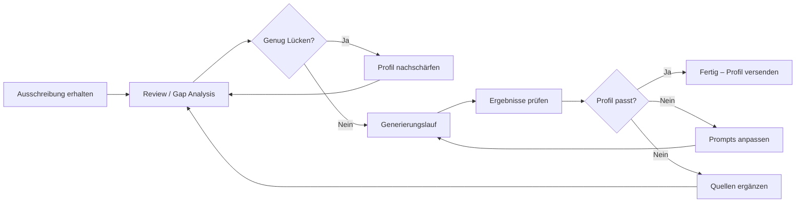

# Benutzerhandbuch

Vom ersten Setup bis zum fertigen Profilentwurf – alle Schritte im Überblick.

---

## 1. Voraussetzungen

| Was | Hinweis |
|---|---|
| **Node.js 18+** | `node --version` prüfen |
| **npm** | `npm --version` prüfen |
| **API-Key** | Kompatibler OpenAI-Endpoint (z. B. OpenAI, Azure, Ollama) |
| **Profil + Projekte** | Dein CV, deine Projekthistorie (PDF, DOCX oder als Text) |

## 2. Installation und Einrichtung

```bash
# Repository klonen
git clone <repo-url>
cd freelancer-profil-tool

# Abhängigkeiten installieren
npm install

# API-Key hinterlegen
mkdir -p secrets
```

Erstelle `secrets/secrets.local.yaml`:

```yaml
apiKey: "sk-dein-hier-echt-api-key"
```

**Wichtig:** `secrets/` ist in `.gitignore` – der Key landet nicht im Repository.

### Config prüfen (optional)

Die Datei `config/default.yaml` enthält die LLM-Konfiguration:

```yaml
llm:
  provider: "openai-compatible"
  baseURL: "https://crof.ai/v1"       # Dein API-Endpoint
  model: "kimi-k2.6-precision"        # Dein Modell
  maxTokens: 262144
  temperature: 0

pipeline:
  projectSelection:
    targetCount: 5                     # Anzahl Projekte im Profil
  keywordSelection:
    targetCount: 10                    # Anzahl Keywords
```

Passe `baseURL` und `model` an deinen API-Provider an.

---

## 3. Profil und Projekthistorie einpflegen

Deine persönlichen Daten gehören in das **`sources/`**-Verzeichnis (`.gitignore`, nicht versioniert).

```
sources/
├── profil.yaml              ← Dein Profil
├── projekte.yaml            ← Deine Projekthistorie
└── ausschreibungen/
    └── product-owner.txt    ← Aktuelle Ausschreibung
```

### 3.1 YAML-Struktur verstehen

Bevor du die Beispiele übernimmst, ist die Trennung wichtig:

- **Profil-Skills** in `profil.yaml` beschreiben dein übergreifendes Kompetenzprofil und können ein optionales `rating` tragen.
- **Projekt-Skills** in `projekte.yaml` beschreiben, wie ein Skill im konkreten Projekt vorkam. Dafür ist ein freier `context` meist hilfreicher als ein Rating.

**Profil (`profil.yaml`):**

```yaml
name: "Vorname Nachname"
email: "mail@beispiel.de"
phone: "+49 123 456 789"
location: "Stadt"
title: "Dein aktueller Titel"

availability: "ab MM/JJJJ"          # oder "ab sofort"
capacity: "bis zu 100%"
onsiteWillingness: "bis zu 60%"

summary: >
  Zwei bis drei Sätze Executive Summary – was du machst, wo deine Schwerpunkte liegen.

skills:
  - name: "Skill-Name"
    rating: "high"              # Optional: high | medium | low
  - name: "Nächster Skill"

certifications:
  - "Zertifikatsname"

languages:
  - language: "Deutsch"
    level: "Muttersprache"

workExperience:
  - period: "MM/JJJJ–MM/JJJJ"
    role: "Rolle"
    company: "Firma"

education:
  - degree: "Abschluss"
    institution: "Hochschule"
    period: "MM/JJJJ–MM/JJJJ"
```

**Projekthistorie (`projekte.yaml`):**

```yaml
projects:
  - id: "proj-kundenportal"
    title: "Relaunch Online-Kundenportal"
    client: "Kunde AG"
    industry: "Versicherung"
    description: >
      Zwei bis vier Sätze: Was wurde gemacht, welche Rolle hattest du,
      welche Technologien kamen zum Einsatz, welches Ergebnis wurde erzielt?
    skills:
      - name: "Kundenportal"
        context: "Fachliche Projektleitung und Product Ownership für Relaunch und Weiterentwicklung des Kundenportals."
      - name: "Stakeholder-Management"
        context: "Abstimmung mit Fachbereich, Kundenservice und Vertrieb; Priorisierung der Anforderungen über mehrere Beteiligte hinweg."
      - "Scrum"                 # weiter erlaubt, aber weniger aussagekräftig
    duration: "01/2022–09/2022"
```

Ein vollständiges Beispiel findest du in `tests/fixtures/profile-sources/example-profil.yaml` und `tests/fixtures/project-histories/example-projekte.yaml`. Die Fixtures zeigen bewusst ein eher kompaktes Minimalformat; für produktive Projektdaten ist `skills[].context` meist die bessere Wahl.

### 3.2 Gute Skill-Kontexte für Projekte schreiben

Der Projekt-Skill-`context` ist bewusst **keine** fertige Profilformulierung. Er darf roh, operativ und ehrlich sein. Das LLM nutzt ihn als Evidenz und formuliert daraus später eine professionell verdichtete Aussage.

Gut geeignet sind Kontexte wie:

- `"Operative Nutzung im Tagesgeschäft bei Kundenanfragen; relevant als praktische Systemkenntnis im energiewirtschaftlichen Kontext."`
- `"Abstimmung mit Fachbereich, Kundenservice und externen Dienstleistern; keine disziplinarische Führung."`
- `"Fachliche Mitgestaltung der Zielprozesse, aber keine eigene technische Implementierung."`

Wichtig:

- Verantwortung nicht künstlich erhöhen
- Randständige Erfahrung als randständig markieren
- Systemkenntnis, Domänennähe und Prozessbezug explizit machen, wenn sie relevant sind

### 3.3 Konvertierungs-Prompt: PDF/DOCX → YAML

Wenn dein Profil bereits als CV (PDF, DOCX, Text) vorliegt, verwende diesen Prompt mit einem LLM deiner Wahl (z. B. ChatGPT, Claude, Kimi), um es in das YAML-Format zu überführen:

---

**Prompt:**

```
Ich habe einen Lebenslauf / ein Profil, das ich in ein strukturiertes YAML-Format überführen möchte. 
Wandle den folgenden Text in das unten beschriebene YAML-Schema um. 

Ergänze nur, was explizit im Text steht – erfinde keine Skills, Projekte oder Erfahrungen.
Falls ein Feld im Quelltext nicht vorkommt, lass es weg oder setze einen leeren Wert.
Achte auf die korrekte YAML-Syntax (Einrückung, Anführungszeichen bei Sonderzeichen).

---

YAML-Schema für das Profil (Datei: profil.yaml):

name: "Vorname Nachname"
email: "email@domain.de"
phone: "+49 ..."
location: "Stadt"
title: "Aktuelle Berufsbezeichnung / Titel"
availability: "ab MM/JJJJ oder ab sofort"
capacity: "bis zu XX%"
onsiteWillingness: "bis zu XX%"
summary: >
  Zwei bis drei Sätze Executive Summary.

skills:
  - name: "Skill 1"
    rating: "high"  # optional
  - name: "Skill 2"

certifications:
  - "Zertifikat 1"

languages:
  - language: "Deutsch"
    level: "Muttersprache"

workExperience:
  - period: "MM/JJJJ–MM/JJJJ"
    role: "Rolle"
    company: "Firma"

education:
  - degree: "Abschluss"
    institution: "Hochschule"
    period: "MM/JJJJ–MM/JJJJ"

---

YAML-Schema für die Projekthistorie (Datei: projekte.yaml):

projects:
  - id: "proj-kurzname"
    title: "Projekttitel"
    client: "Auftraggeber"
    industry: "Branche"
    description: >
      2-4 Sätze: Beschreibung der Aufgabe, der Rolle, der Technologien/Methoden,
      des Ergebnisses. Keine Übertreibungen, nur Fakten aus dem CV.
    skills:
      - name: "Verwendeter Skill / Technologie"
        context: "Freie, ehrliche Rohbeschreibung, wie der Skill im Projekt vorkam. Darf auch operativ oder randständig formuliert sein."
    duration: "MM/JJJJ–MM/JJJJ"

---

Hier ist der Text meines Lebenslaufs:
<Füge hier den Text deines CVs ein>
```

---

Tipp: Wenn dein CV sehr umfangreich ist, extrahiere zuerst den Text (z. B. mit `pdftotext`) und füge ihn anstelle von `<Füge hier den Text deines CVs ein>` ein. Für DOCX-Dateien kannst du den Text direkt kopieren und einfügen oder Tools wie `pandoc` verwenden:

```bash
# PDF in Text konvertieren
pdftotext mein-profil.pdf profil-text.txt

# DOCX in Markdown konvertieren (für bessere Struktur)
pandoc mein-profil.docx -o profil-text.md
```

---

## 4. Prompts an eigene Präferenzen anpassen

Alle LLM-Prompts liegen als YAML-Dateien in `prompts/`. Du kannst sie an deinen persönlichen Stil anpassen – ohne Code zu ändern.

| Datei | Schritt | Anpassbar |
|---|---|---|
| `prompts/01-requirements-map-prompt.yaml` | Anforderungsanalyse | – |
| `prompts/02-keywords-prompt.yaml` | Keyword-Kuration | Keyword-Auswahlregeln |
| `prompts/03-rank-projects-prompt.yaml` | Projekt-Ranking | Ranking-Kriterien |
| `prompts/04-profile-hook-prompt.yaml` | Einleitung | Stilvorgaben, verbotene Wörter, Beispiele |
| `prompts/05-project-adaptation-prompt.yaml` | Projekt-Adaption | Stilvorgaben (z. B. Nominalstil) |

### Shared-Strategien (zentrale Logik)

Einige Regeln werden von mehreren Prompts gemeinsam genutzt und sind in `prompts/_shared/` zentral definiert:

| Datei | Enthält |
|---|---|
| `prompts/_shared/evidenz-strategie.yaml` | Coverage-Definitionen, priority × coverage-Matrix, Claim-Kalibrierung |
| `prompts/_shared/analyse-grundsaetze.yaml` | Granularitätsregeln, implizite Anforderungen erkennen |

**Änderungen an Coverage-Stufen, Kombinationslogik oder Analyse-Prinzipien immer hier vornehmen** – sie gelten dann automatisch für alle Prompts, die die entsprechende Variable (`{{EVIDENZ_STRATEGIE}}` oder `{{ANALYSE_GRUNDSAETZE}}`) referenzieren.

### Typische Anpassungen

- **Stil der Einleitung** – `prompts/04-profile-hook-prompt.yaml`: "selbstbewusst, strategisch" oder "bescheiden, sachlich"?
- **Verbotene Wörter** – `prompts/04-profile-hook-prompt.yaml`: Signalwörter wie "vorangetrieben" entfernen/hinzufügen
- **Projekt-Stil** – `prompts/05-project-adaptation-prompt.yaml`: Nominalstil ("Leitung von…") vs. Ich-Perspektive
- **Keyword-Fokus** – `prompts/02-keywords-prompt.yaml`: Sollen Methoden stärker gewichtet werden als Technologien?

---

## 5. Ausschreibungstext hinterlegen

Lege die Job-Ausschreibung als Textdatei ab:
- Format: **einfache `.txt`-Datei**
- Ort: `sources/ausschreibungen/` (oder ein beliebiger anderer Pfad)
- Inhalt: Kopiere den vollständigen Ausschreibungstext hinein

```bash
# Beispiel
sources/ausschreibungen/product-owner.txt
```

---

## 6. Gap Analysis durchführen

Der `review`-Befehl prüft, wie gut deine Quellen zur Ausschreibung passen, **bevor** der eigentliche Profilentwurf erzeugt wird:

```bash
npx tsx src/cli/cli.ts review \
  -p sources/ausschreibungen/product-owner.txt \
  -s sources/profil.yaml \
  -s sources/projekte.yaml
```

**Was passiert:**
- Der LLM analysiert die Ausschreibung und extrahiert alle Anforderungen
- Jede Anforderung wird bewertet: Priorität (hoch/mittel/niedrig) × Coverage (gut\_belegt/schwach\_gestuetzt/unbelegt)
- Für unbelegte oder schwach gestützte Anforderungen gibt es Verbesserungsvorschläge

**Ausgabe:** `runs/<run-id>/review.html`

**Ergebnis interpretieren:**

```yaml
findings:
  - requirement: "Kenntnisse in Conversational AI"
    status: "unbelegt"
    priority: "niedrig"
    gapPriority: "niedrig"
    suggestedEvidence: "Projekt mit Chatbot-Integration oder entsprechende Zertifikate"
    suggestedSourceLocation: "projektbeschreibung"
```

- **`status: unbelegt`** mit **`priority: hoch`** → kritische Lücke, unbedingt nachbessern
- **`status: schwach_gestuetzt`** → vorhandene Evidenz im Profil/Projekttext klarer formulieren
- **`status: gut_belegt`** → keine Aktion nötig

---

## 7. Profil nach der Gap Analysis nachschärfen

Basierend auf der Gap Analysis kannst du deine Quelldaten verbessern:

### Typische Nachschärfungen

1. **Kritische Lücken schließen** (`unbelegt` + `priority: hoch`)
   - Fehlende Skills im Profil ergänzen (falls vorhanden)
   - Projektbeschreibungen um relevante Aspekte erweitern
   - Ggf. fehlende Erfahrung durch Fortbildung/Projektarbeit nachweisen

2. **Schwach gestützte Anforderungen stärken**
   - Vorhandene Evidenz in Projektbeschreibungen **expliziter** formulieren
   - Statt "war für Koordination zuständig" → "Abstimmung mit Fachbereich, IT und Management" 
   - Konkrete Technologie- oder Methodennamen ergänzen

3. **Unnötige Lücken vermeiden**
   - Stelle sicher, dass deine Skills und Projekte die zentralen Anforderungen der Ausschreibung klar adressieren

**Wichtig:** Erfinde keine Fakten. Das Tool erkennt auch nach der Nachschärfung, wenn etwas nicht belegbar ist – du machst nur vorhandene Evidenz besser sichtbar.

---

## 8. Generierungslauf durchführen

Wenn die Gap Analysis zufriedenstellend ist, starte den Hauptlauf:

```bash
npx tsx src/cli/cli.ts run \
  -p sources/ausschreibungen/product-owner.txt \
  -s sources/profil.yaml \
  -s sources/projekte.yaml \
  --language de
```

### Flags im Überblick

| Flag | Beschreibung | Standard |
|---|---|---|
| `-p, --posting` | Pfad zur Ausschreibung (Pflicht) | – |
| `-s, --sources` | Quellen (Profil + Projekte, mehrfach oder kommasepariert) | – |
| `-t, --steering` | Optionale Steuerhinweise für den Lauf | – |
| `-c, --config` | Pfad zur Config-Datei | `config/default.yaml` |
| `--language` | Zielsprache (`de` oder `en`) | `de` |
| `--pdf` | Zusätzlich PDF aus dem Profil erzeugen | – |

**Zielsprache einstellen:**

```bash
# Deutsches Profil
--language de

# Englisches Profil
--language en
```

**Steuerhinweise verwenden:**

```bash
# Schwerpunkte oder Hinweise für die Ausrichtung
-t "Stärker auf Führungserfahrung eingehen" -t "Budgetverantwortung betonen"
```

### 8.1 PDF-Generierung

Zusätzlich zum YAML-Entwurf kann ein PDF erzeugt werden.

```bash
# Direkt nach dem Pipeline-Lauf
npx tsx src/cli/cli.ts run -p posting.txt -s profil.yaml -s projekte.yaml --pdf

# Nachträglich für einen bestehenden Run (ohne Neulauf)
npx tsx src/cli/cli.ts pdf <run-id>
```

Das HTML-Template liegt standardmäßig in `pdf-templates/profil-template.html` und verwendet **Handlebars** als Template-Engine – Schleifen, Bedingungen und Variablen werden direkt im HTML ausgewertet, kein TypeScript-Eingriff nötig.

Wichtige Config-Werte in `config/default.yaml`:
- `pipeline.projectSelection.targetCount` – Anzahl Projekte
- `pipeline.keywordSelection.targetCount` – Anzahl Keywords
- `pdf.templatePath` – Pfad zum HTML-Template
- `pdf.appendPdfPath` – Optional: Pfad zu einem statischen PDF, das angehängt wird (z. B. vollständiger CV)

#### Prompt-Vorlage: Template generieren/anpassen per LLM

Wenn du das Template von einem LLM (z. B. ChatGPT, Claude) generieren oder anpassen lassen möchtest, kopiere folgenden Prompt:

> Erstelle ein HTML-Template für ein Freelancer-Profil als A4-PDF (210 mm × 297 mm). Das Template verwendet **Handlebars** als Template-Engine – kein TypeScript, alles wird im HTML gerendert.
>
> **Verfügbare Datenvariablen (alle von Handlebars escaped):**
>
> | Variable | Typ | Beschreibung |
> |---|---|---|
> | `{{name}}` | string | Name des Freelancers |
> | `{{title}}` | string | Berufsbezeichnung |
> | `{{tagline}}` | string | Kurzer Untertitel |
> | `{{email}}` | string | E-Mail |
> | `{{phone}}` | string | Telefon |
> | `{{location}}` | string | Standort |
> | `{{availabilityText}}` | string | Verfügbarkeit (z. B. "ab 09/2026 · bis zu 100% · bis zu 100%") |
> | `{{summary}}` | string | Executive Summary |
> | `{{portraitPath}}` | string | Datei-Pfad zum Portrait-Foto (für ``) |
> | `{{skills}}` | string[] | Liste der Skill-Keywords |
> | `{{projects}}` | PdfProject[] | Liste der Projekte (siehe unten) |
> | `{{certifications}}` | string[] | Zertifizierungen |
> | `{{education}}` | PdfEducation[] | Ausbildung (siehe unten) |
> | `{{languages}}` | PdfLanguage[] | Sprachen (siehe unten) |
>
> **PdfProject** – jedes Objekt hat:
> - `{{title}}` – Projekttitel
> - `{{client}}` – Auftraggeber
> - `{{branch}}` – Branche
> - `{{period}}` – Zeitraum
> - `{{desc}}` – Projektbeschreibung
>
> **PdfEducation** – jedes Objekt hat:
> - `{{degree}}` – Abschluss
> - `{{institution}}` – Hochschule
> - `{{period}}` – Zeitraum
>
> **PdfLanguage** – jedes Objekt hat:
> - `{{lang}}` – Sprache
> - `{{level}}` – Niveau
>
> **Handlebars-Helper (zusätzlich zu den Built-ins):**
> - `{{#ifPositive <array>}}...{{/ifPositive}}` – Block nur rendern, wenn das Array nicht leer ist
> - `{{join <array> "<trennzeichen>"}}` – Array-Elemente mit Trennzeichen verbinden (funktioniert nur für `string[]`, z. B. `{{join certifications " · "}}`)
> - Für Objekt-Arrays (z. B. `languages`, `projects`, `education`) mit `{{#each}}` iterieren und Felder direkt referenzieren, z. B. `{{#each languages}}{{lang}}: {{level}}{{#unless @last}} · {{/unless}}{{/each}}`
> - Alle Standard-Handlebars-Helper wie `{{#each}}`, `{{#if}}`, `{{#unless}}` funktionieren
>
> **Anforderungen an das Layout:**
> - Exaktes A4-Format: 210 mm × 297 mm
> - `@page { size: A4; margin: 0; }` im CSS
> - `.page { width: 210mm; height: 297mm; overflow: hidden; position: relative; }` als Container
> - Das HTML muss eigenständig funktionieren – keine externen Stylesheets, keine externen Fonts
> - `-webkit-print-color-adjust: exact; print-color-adjust: exact;` für zuverlässige Farben im PDF
> - Wähle ein professionelles, klares Farbschema, Schriftarten und Layout selbstständig (z. B. Blau- oder Grautöne, serifenlose Schrift, Portrait links + Kontaktdaten daneben, Skills als Raster, Projekte mit farbigem Rand)

---

## 9. Generierte Dateien prüfen

Nach erfolgreichem Lauf liegen alle Ergebnisse in `runs/<run-id>/`:

### `profile-draft.yaml`

**Das editierbare YAML-Profil** – generierte Inhalte (Summary, Skills, Projekttexte) zuerst, dann Stammdaten. Dies ist die Datei, die du bearbeiten kannst, bevor du daraus ein PDF erzeugst. Wird sowohl von der Pipeline als auch vom `pdf`-Befehl gelesen.

**Prüfe:**
- Klingt die Einleitung authentisch und passend zur Ausschreibung?
- Sind die Projektbeschreibungen korrekt (keine erfundenen Fakten)?
- Fehlen wichtige Aspekte, die im Profil vorhanden sind, aber nicht im Entwurf auftauchen?

### `run-meta.yaml`

**Die fachliche Herleitung des Laufs + Diagnose in einer Datei.** Zeigt:
- Welche Anforderungen erkannt wurden (Requirements Map mit Priorität, Coverage, Evidenz)
- Welche Keywords ausgewählt wurden
- Wie die Projekte gerankt sind (mit Begründungen)
- Welcher Kompositionsplan (Abschnitte + Modi) angewandt wurde
- Laufzeiten, LLM-Nutzung
- Strukturelle Schwächen und Nachschärfungsvorschläge

**Prüfe:**
- Wurden alle wichtigen Anforderungen erkannt?
- Ist die Priorisierung nachvollziehbar?
- Sind die richtigen Projekte ausgewählt?
- Welche Anforderungen sind nur schwach gestützt? Kannst du die Evidenz verbessern?

### `llm-traces.yaml`

**Prompt/Response-Traces aller LLM-Calls.** Enthält:
- Vollständige Prompts (inklusive expandierter Shared-Strategien)
- LLM-Antworten
- Token-Verbrauch pro Call

**Wofür:** Debugging und Optimierung der eigenen Prompts. Wenn die Ausgabe nicht deinen Erwartungen entspricht, findest du hier, was genau an das LLM gesendet wurde.

### `profile-draft.pdf` (optional)

Wird nur erzeugt, wenn du `run --pdf` oder `pdf <run-id>` verwendest. Das PDF basiert auf `profile-draft.yaml` und dem Handlebars-Template in `pdf-templates/`.

### `inspect.html` (optional)

Wird nur erzeugt, wenn du `inspect <run-id>` ausführst. Dient als browserlesbarer Review-Report für Ranking, Requirements-Map und Diagnostics.

### `review.html` (nur nach `review`-Befehl)

Der browserlesbare Preflight-Report. Er zeigt die Requirements-Fit-Analyse inklusive Coverage, Begründung und konkreten Nachschärfungshinweisen.

---

## 10. Ergebnisse inspizieren (HTML)

Das `inspect`-Kommando erzeugt eine selbstständige HTML-Seite aus `run-meta.yaml` und den Run-Diagnostics:

```bash
npx tsx src/cli/cli.ts inspect 20260521-3810ca
```

Ergebnis:

- `runs/<run-id>/inspect.html`

Die HTML-Seite enthält u. a.:

- Projekt-Ranking mit Begründungen
- Requirements-Map mit Priorität, Coverage und Evidenztyp
- Diagnostics, Schwächen und Nachschärfungsvorschläge direkt bei den betroffenen Anforderungen
- Kompositionsmodi der Abschnitte

Typischer Aufruf danach:

```bash
xdg-open runs/20260521-3810ca/inspect.html
```

---

## 11. Workflow-Wiederholung

Ein realistischer Arbeitszyklus sieht so aus:



---

## Vollständiges Beispiel (von 0 auf Profil)

```bash
# 1. Profil und Projekte in sources/ ablegen
#    (PDF-Konvertierung mit Prompt aus Abschnitt 3.3)

# 2. Ausschreibungstext speichern
cp ~/Downloads/product-owner.txt sources/ausschreibungen/

# 3. Gap Analysis
npx tsx src/cli/cli.ts review \
  -p sources/ausschreibungen/product-owner.txt \
  -s sources/profil.yaml \
  -s sources/projekte.yaml

# 4. (optional) Profil nachschärfen, basierend auf review.html

# 5. Generierung
npx tsx src/cli/cli.ts run \
  -p sources/ausschreibungen/product-owner.txt \
  -s sources/profil.yaml \
  -s sources/projekte.yaml \
  --language de

# 6. Ergebnis prüfen
cat runs/*/profile-draft.yaml
```

---

## Fehlt noch was?

Folgende Themen sind hier nicht vertieft:

- **CI/CD einrichten** – Wiederkehrende Läufe automatisieren (z. B. per Makefile oder npm script)
- **Mehrere Profile verwalten** – Unterschiedliche Profile für verschiedene Zielbranchen
- **Eigener LLM-Provider** – Andere Endpunkte als Crof AI (OpenAI, Azure, Ollama, lokal)
- **Batch-Verarbeitung** – Mehrere Ausschreibungen nacheinander durchlaufen

Wenn du eines dieser Themen vertiefen möchtest, erweitere ich das Handbuch gerne.
